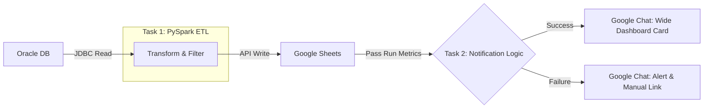

# 🚀 Oracle to Google Sheets: ETL Pipeline


## 📋 Project Context: The Challenge
**Situation:** Warehouse operations teams at Ludwigsfelde (LUU) were spending **20–40 minutes per shift** manually extracting heavy reports (>70MB) from the legacy TGW Infosystem to track dangerous goods.

**The Pain Points:**
* **Operational Bottleneck:** Manual data retrieval was repetitive and delayed critical decision-making at shift starts.
* **Scalability Issues:** Importing large datasets directly into Google Sheets caused browser crashes and exceeded AppScript execution limits.
* **Lack of Visibility:** If a manual update was missed, stakeholders worked with stale data without knowing it.

## 💡 The Solution
I engineered a **Databricks-based ETL pipeline** using **PySpark** for distributed processing and **Task Orchestration** for reliability. The system queries the Oracle database directly, processes the data in the cloud, and pushes only the necessary insights to the dashboard.

### 🏗️ Architecture & Workflow
The pipeline utilizes **Databricks Workflows** to manage dependencies. The notification task *only* runs after the ETL task completes, inheriting the run metrics.



## 📈 Key Results & Business Impact

| Metric | Before (Manual) | After (Automated) |
| :--- | :--- | :--- |
| **Update Time** | 20–40 Minutes | **< 1 Minute** |
| **Reliability** | Prone to human error | **99.9% Uptime** |
| **Data Freshness** | Stale by hours | **Real-time (Shift start)** |
| **Manual Effort** | High (Repetitive) | **Zero (Fully Autonomous)** |

* **Impact:** Powered the [DG Monitor Dashboard](https://github.com/Hari-prasanna/BI-Tools-Projects/blob/main/LUU-DG-Monitor/README.md), ensuring strict adherence to the 20-Liter threshold for dangerous goods storage.


## 🛠️ Technical Deep Dive

### 1. Distributed Processing (PySpark)
Moved from standard Pandas to **PySpark** to ensure future scalability and faster processing times.

* **Optimized Reads:** Leveraged JDBC to query raw inventory data directly from Oracle.
* **Transformation:** Used Spark DataFrames for regex-based filtering (`^\d`) to clean the dataset before it ever hits the visualization layer.

### 2. Job Orchestration & Dependencies
The pipeline is not just a script; it is a **multi-task workflow**:

* **Task 1 (ETL):** Handles the heavy lifting. If this fails, the workflow stops immediately to prevent bad data load.
* **Task 2 (Notifier):** A dependent task that utilizes `dbutils.jobs.taskValues`. It dynamically fetches the `row_count` and `status` from the previous task context to generate the report.

### 3. Adaptive "ChatOps" Notification System
I developed a custom notification script using **Google Chat Cards V2** that adapts the UI based on the job status:

* **✅ Success State (Horizontal Layout):**
    * Uses a **Column Widget** to display "Run Time" and "Rows Processed" side-by-side for quick scanning.
    * **Action:** Direct link to the Looker Studio Dashboard.
* **❌ Failure State (Alert Layout):**
    * Displays error headers and a warning icon.
    * **Action:** Provides a "Call to Action" button linking to the **Manual Import Sheet**, ensuring operations can continue even if the automation fails.


## ⚙️ Setup & Configuration

1.  **Environment:** Databricks Workspace (Standard/Premium) with a Spark Cluster (Runtime 12.2 LTS or higher).
2.  **Secrets Management:**
    * `oracle_credentials`: Stored safely in Databricks Secrets scope.
    * `google_service_account`: JSON key for Google Sheets API authentication.
3.  **Scheduling:** Cron schedule configured for specific shift handovers:

    ```cron
    0 0 5,15 * * ?  # Runs daily at 05:00 and 15:00 Berlin Time
    ```
