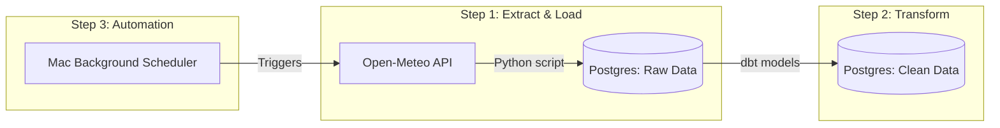

# ⛅ Weather ELT Pipeline: Automated Data Engineering


## 📖 Project Overview
This project is a fully automated Extract, Load, and Transform (ELT) data pipeline. Every day, it silently wakes up in the background, fetches live weather data for 10 cities in Germany using an API, saves it to a local database, and cleans the data so it is ready for a dashboard. 

I built this project to transition from simply "writing Python scripts" to **building self-sustaining data systems**.

## 🧠 What I Learned (The Engineering Journey)
This project was a deep dive into "Under the Hood" software engineering. Here are the biggest concepts I mastered:

* **Environment Isolation (Virtual Environments):** I learned how to quarantine my project using a Python `venv`. This ensures my heavy data tools (like dbt and Pandas) are locked inside the project folder, keeping my Mac's global system 100% clean and untouched.
* **Security & Git Hygiene:** I learned how to use `.env` files and `.gitignore` to strictly hide my database passwords and heavy system files. I also learned how to resolve complex Git merge conflicts and manage local vs. cloud repositories.
* **Hands-Free Automation (Cron & Bash):** Instead of manually clicking "Run," I wrote a Bash master script (`run_pipeline.sh`) and tied it to my Mac's internal Cron scheduler (`@reboot`). Now, whenever my computer turns on, the pipeline runs itself flawlessly.
* **dbt Transformations:** Instead of doing all the data cleaning in Python, I learned how to use dbt to transform the raw data directly inside the PostgreSQL database using modular SQL.

## 🏗️ How It Works (Architecture)



## 🛠️ Tech Stack Used
* **Python (Pandas, Requests):** For connecting to the API and extracting the data.
* **PostgreSQL:** The local data warehouse storing the records.
* **dbt (Data Build Tool):** For cleaning, testing, and formatting the data using SQL.
* **Bash Scripting & Cron:** For creating the automated master switch.
* **Git/GitHub:** For version control and portfolio hosting.

## 🚀 How to Run It Locally

**1. Clone the repository:**
```bash
git clone [https://github.com/Hari-prasanna/Data-Analytics-engineering-portfolio.git](https://github.com/Hari-prasanna/Data-Analytics-engineering-portfolio.git)
cd weather-elt-pipeline
```

**2. Set up the secure environment:**
Create a `.env` file in the main folder to hold your local database credentials:
```env
DB_USER=your_user
DB_PASSWORD=your_password
DB_HOST=localhost
DB_PORT=5432
DB_NAME=weather_db
```

**3. Build the virtual environment and install tools:**
```bash
python3 -m venv venv
source venv/bin/activate
pip install -r requirements.txt
```

**4. Flip the master switch:**
Run the automation script to extract the data and build the dbt models:
```bash
./run_pipeline.sh
```